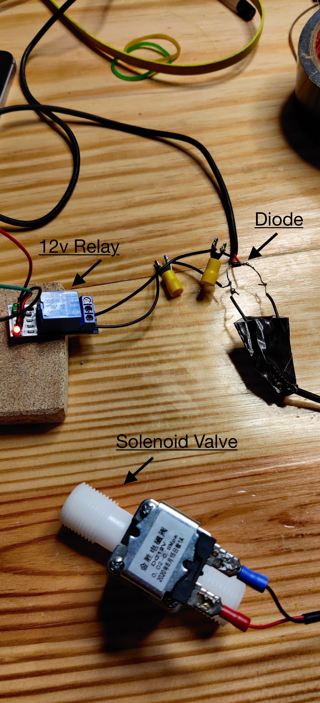
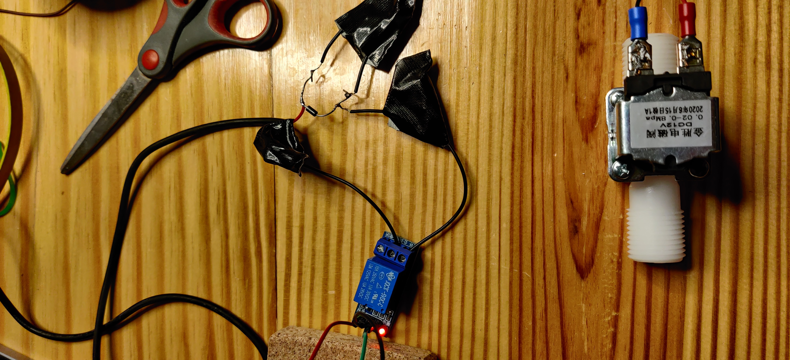
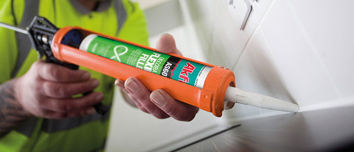
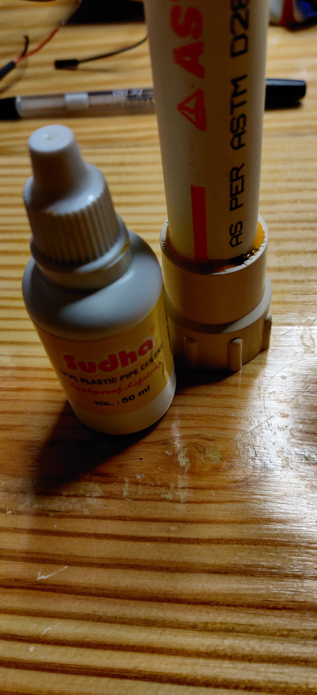
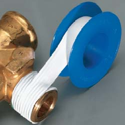
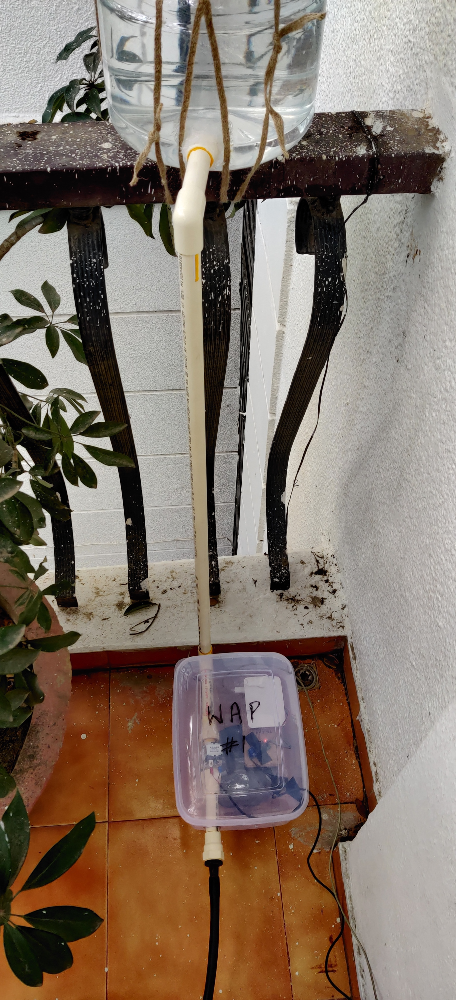

# wet-ass plants

schedule/control a drip-irrigation system – the code effectively just turns on/off a gpio pin (so you can probably do other simple things with it)

## code

#### setup

* get an rpi and [set it up](https://gist.github.com/kitallis/7b5ba8ffb9045bd3dce6cd710e00f26a)
* install [crontab-ui](https://github.com/alseambusher/crontab-ui) on it
* download the WAP binary
* configure it to be [scheduled](http://www.fao.org/3/s8684e/s8684e07.htm) using crontab-ui

#### build

* Run `make` to [cross-compile](https://github.com/japaric/rust-cross) a debug build for the RPi 4
* Run `make release=1` for a release build
* Run `make all release=1` to build and install the binary on to the RPi (specify your RPi address in the `Makefile`)

Run `./wap` to see the usage. The command that I use on my crontab:

```bash
cd $HOME/wap && ./wap 12 120000 20000
```

## circuit

(please excuse my terrible soldering, I have no prior experience in this)

Since I didn't have a perfboard and I wanted to avoid a breadboard for long-term usage, I decided to solder up the wires over these terminal tongs for ease of visibility.



After some crappy insulation using a gaffer tape to prevent against accidental water-damange:



## plumbing (literally)

#### drip irrigation kit

I got a kit like [this](https://www.amazon.in/CINAGRO-Irrigation-Garden-Watering-Plants/dp/B07GMVDTH1) that has a main 2/3" hose that you can further extend to a smaller hose that feeds into individual plants; instructions to chop and slice are fairly self-explanatory.

#### additional plumbing

The pipe seals are exteremely important in this system, I made use of 3 things for various different seals:

1. Cut open the mouth of the canister (where the tap used to be). Insert a 3/4" pipe holder and seal it with a silicon sealant.

2. Use pipe cement to join together the elbow joints with the PVC pipes.

3. Use thread-seal tapes for joints involving screwing in the joint threads (like the one on the valve).


#### water

I don't have an active tap in any of my balconies that house the plants, so I hung a water canister like this with at least 3-4L of stored water to provide enough downward pressure to reach all plants



## 🚚 🚚 🚚 🚚


